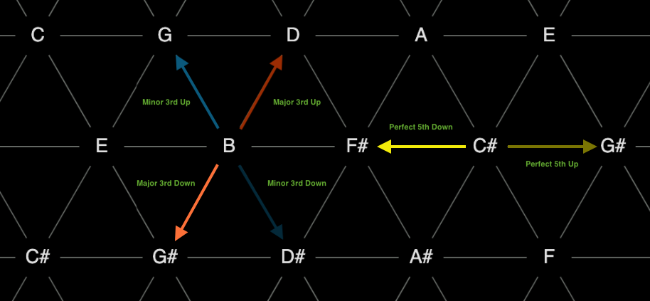
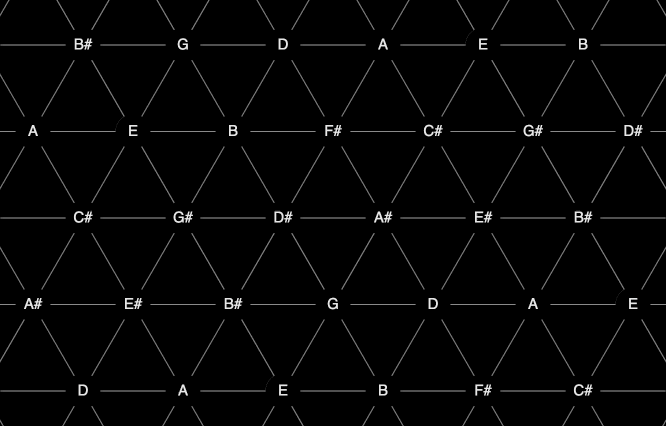
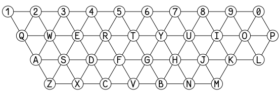
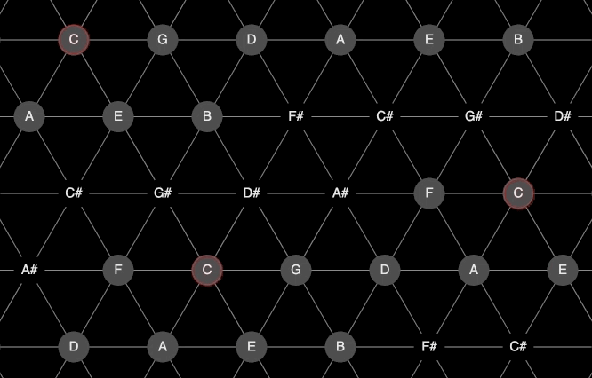
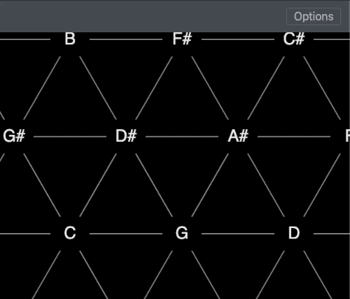

# toneZ

**toneZ** is a tonnetz diagram viewer built for browser in *html5 + css3 + javascript* using [p5.js](https://p5js.org/) for graphics and the [Tone.js](https://tonejs.github.io/) for sound.

The tonnetz (German for 'Tonal Lattice' or 'Tonal Net') is a lattice diagram representing tonal space. It can be used to visualize harmonic relationships in music. \
Each node in the diagram corresponds to one of the 12 tones and is connected to 6 adjacent nodes. \
The 'neighbours' of each tone are related to it either by a third (major or minor) or by a perfect fifth, depending on their relative position in the diagram.

<p align="center"></p>

<p align="center"></p>

See [Tonnetz][1], [Isochord][2] and [Neo-Remannian Theory][3] for more info.


## Getting Started

You just need to serve the main folder and then navigate to the ```index.html``` file to run the software. \
If your browser supports the Web MIDI API, you can use **toneZ** with any MIDI-enabled instrument otherwise you can use your computer's keyboard to control the app with the built-in keyboard mapping depicted below.

<p align="center"></p>

You can also use the web app **[here](https://loretalone.github.io/toneZ/)** (GitHub Host service).

## Standard Mode
In this mode, you can find the standard tonnetz grid enhanced with the possibility of showing all the different diatonic scales in all keys and modes.

<p align="center"></p>
<p align="center"></p>

You can also enable the "show voicings" options in order to visualize for each note its 3rd and 7th grade according to the current key and mode.

<p align="center"></p>

Furthermore, you can also find a synthesizer composed by a selectable oscillator and a built-in and customizable ADSR envelope.

<p align="center"></p>


## Game Mode
Here you can have fun learning the tonnetz system on your MIDI keyboard. The program shows some triads on the grid and you will have to find and play the right chords on the keyboard.
**Beware!** Every wrong note makes you lose a life!

<p align="center"></p>


## Browser Compatibility

This project is compatible with most common browsers. However, MIDI functionality is available just for a few browsers (Google Chrome and Microsoft Edge).


## Built With

* HTML5 + CSS3 + Javascript
* [p5.js](https://p5js.org/)
* [Tone.js](https://tonejs.github.io/)
* [Bootstrap 4.5](https://getbootstrap.com/)


## Authors

* **Antonio Giganti** - [GitHub](https://github.com/antonelse)
* **Lorenzo Talone** - [GitHub](https://github.com/LoreTalone)


## License

This project is licensed under the GNU General Public License v3 - see ```LICENSE.txt``` for details.

**toneZ** - browser tonnetz visualizer. \
Copyright (C) 2020  Antonio Giganti & Lorenzo Talone


## Links

* [Video](https://youtu.be/6UYUe8NLkVk) - on YouTube
* [GitHub repository](https://github.com/LoreTalone/toneZ)

[1]: https://en.wikipedia.org/wiki/Tonnetz "Wikipedia article about the Tonnetz"
[2]: https://www.researchgate.net/publication/221474662_Isochords_visualizing_structure_in_music "Conference Paper regarding the Tonnetz musical structure visualization"
[3]: https://en.wikipedia.org/wiki/Neo-Riemannian_theory "Wikipedia article about the underlying Tonnetz theory, the Neo-Remannian theory"
